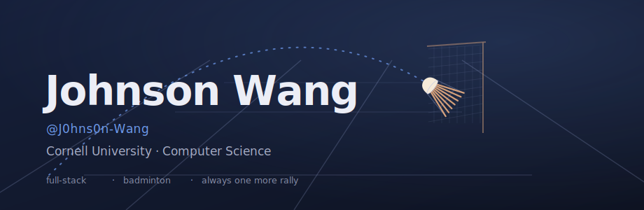

<!-- ════════════════════════════════════════════════════════════════
     Johnson Wang · GitHub profile README
     Drop this file + the /assets folder into your J0hns0n-Wang/J0hns0n-Wang repo.
     Theme: "Blue Box" — dusk navy with warm gym-light accents, badminton motifs.
     ════════════════════════════════════════════════════════════════ -->

  

## • About `// 01`

CS student at **Cornell** who likes building full-stack web apps — Vue / React on the
front, Flask / Express / Django holding it down on the back. Off-screen you'll find me
on the badminton court, chasing shuttlecocks instead of bugs. I care about clean
interfaces, fast feedback loops, and shipping.

`🎓 Cornell · CS` &nbsp; `⚡ full-stack` &nbsp; `🏸 badminton` &nbsp; `📍 UTC-04`

## • Skills `// 02`

**LANGUAGES**

  

**FRAMEWORKS &amp; TOOLS**

  

## • Stats `// 03`

  

## • Off the Clock `// 04`

> 🏸 **Now watching** — _Ao no Hako (Blue Box)_
> 🎧 **On repeat** — whatever's getting me through the late-night commits
>
> _Keep your eye on the bird._

<!-- ── footer ───────────────────────────────────────────────────── -->

  🏸 &nbsp; thanks for visiting — always one more rally.

